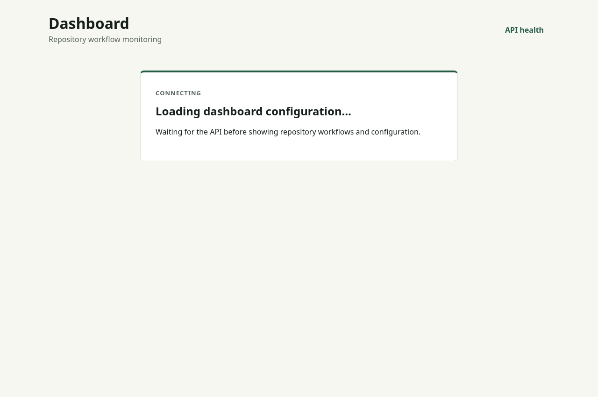
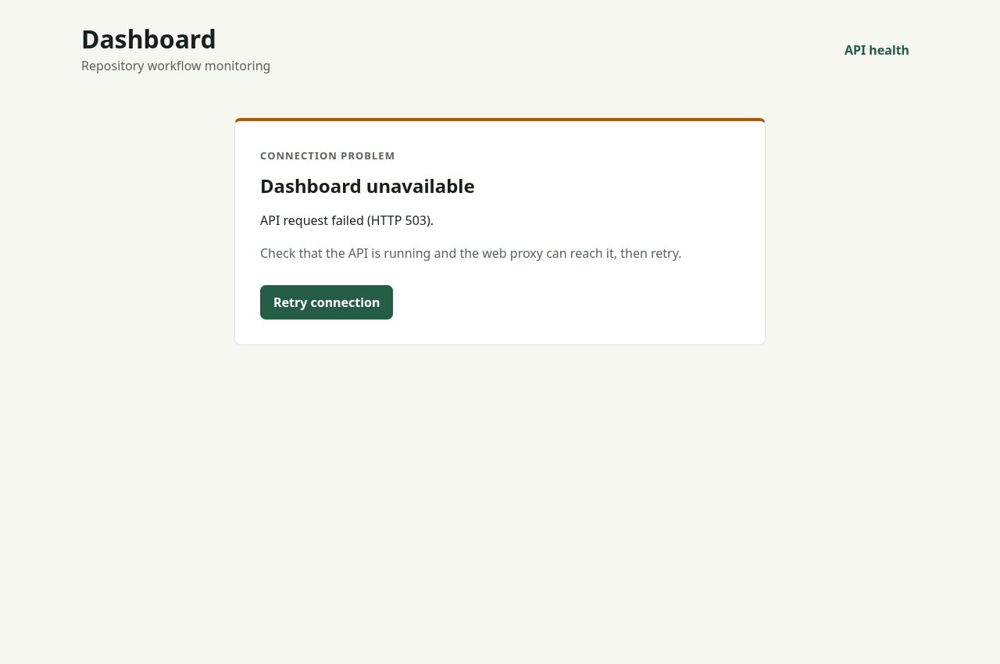

# Dashboard connection states

The dashboard waits for a validated `/api/facade` response before showing the
server's identity or workflow pages. Loading uses a neutral Dashboard heading;
there is no fallback facade presented as effective configuration.

HTTP failures, network failures, non-JSON routing responses, invalid JSON and
missing/invalid facade fields show an explicit error with an API-health link and
retry action. Requests, including body reads, time out after ten seconds. A retry
returns to loading and cannot queue a second request while pending. Query
cancellation aborts abandoned requests. Facade refreshes every thirty seconds;
a refresh failure hides the previously loaded shell until a request succeeds.

Configuration responses are also validated before use. If configuration fails
while the facade succeeds, a warning and separate retry action remain visible.
The Operations panel does not infer disabled plugins or empty repositories from
missing configuration.

The production Nginx configuration proxies **exactly `/healthz`** to the API,
including query strings and upstream failure status. Other paths retain the SPA
fallback. Vite's existing development health proxy uses the same API target.
The API health response already includes capabilities and configuration warnings;
`/readyz` remains an alias of that response. This change does not introduce a
stronger database/worker readiness probe or validate every operational API schema.

## Validation

```sh
cd web
npm ci
npx playwright install chromium
npm test
npm run test:production
```

The browser suite covers delayed, successful, failed, malformed and timed-out
facades; retries; cached-facade refresh failure; invalid configuration; health
JSON and upstream HTTP 503 propagation; and unchanged SPA deep links. Development
uses isolated Vite/API fixture servers and refuses to reuse an existing server.
The production command builds the actual web Dockerfile, runs Nginx with a generic
API fixture on a fresh Docker network, repeats the same suite, and removes its
containers/network/image tag. Docker and the `node:25-bookworm` fixture image are
required. Set `DONKEYSPACE_TEST_OUTPUT` to retain browser screenshots/traces outside
`web/test-results`.

For the authorized umbrella repository, build the API and run the bounded live
harness from the repository root:

```sh
cargo build -p donkeyspace-api
DONKEYSPACE_DASHBOARD_LIVE_TEST=1 python3 web/tests/umbrella-live.py
```

This requires authenticated `gh`, Docker, and the installed Playwright browser.
It creates one fresh, unlabelled umbrella issue; delivers signed GitHub snapshots
to an isolated API; and verifies the changed production dashboard with that real
workflow. It stops the test API to verify the HTTP 502/error state, restarts it,
and retries without reloading the page. It also verifies duplicate delivery,
health JSON and mobile error presentation. No worker or agent runs, and no
production configuration or historical workflow is changed.

Logs, tested revisions, screenshots, scenario links and cleanup results are kept
under `/tmp/donkeyspace-dashboard-live-<run>/`. The harness closes its fresh issue
and removes its test processes, containers, network and image tag. Screenshots
below use only generic regression fixtures.

## Loading



## API unavailable


